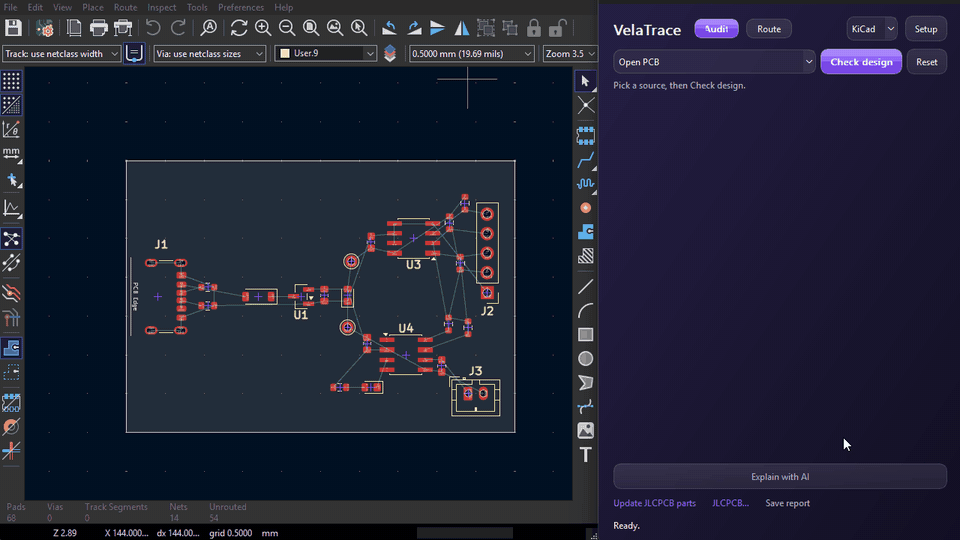
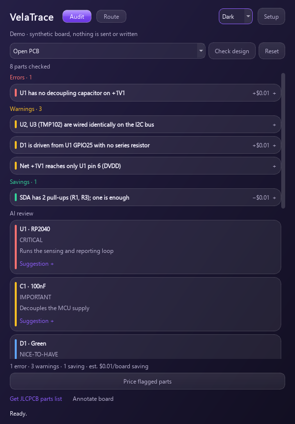
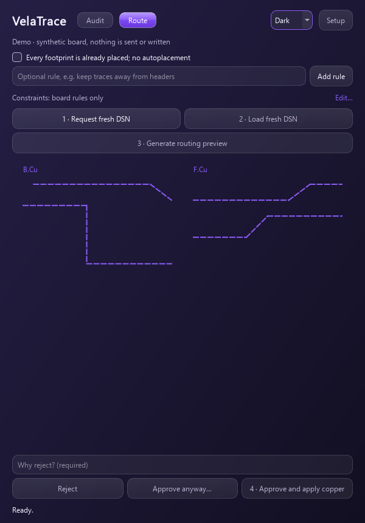

# VelaTrace

**A free, local KiCad 10 plugin: a guarded front-end for Freerouting (preview, KiCad DRC check, one undoable commit) for small unrouted boards, plus an experimental offline rule check. Alpha, tested on Windows only.**

[](LICENSE)
[](https://github.com/F-Blaze/VelaTrace/actions/workflows/ci.yml)
[](https://github.com/F-Blaze/VelaTrace/actions/workflows/codeql.yml)
[](pyproject.toml)
[-314cb0)](https://www.kicad.org/)
[](#quickstart)

<p align="center">
  
</p>
<p align="center"><sub>Recorded on the demo board in <a href="examples/velatrace-demo">examples/velatrace-demo</a>, which has deliberately planted issues. Waiting time is cut; the route took about 10 seconds.</sub></p>

<p align="center">
  
  &nbsp;
  
</p>
<p align="center"><sub>Screenshots use the built-in synthetic demo (<code>python -m velatrace --demo</code>): no API, IPC or board writes.</sub></p>

VelaTrace is a companion window for KiCad's PCB Editor. It is free (MIT), offline by default (network use is opt-in and listed in [docs/privacy.md](docs/privacy.md)), and there is no backend or paid service behind it. It is an alpha: expect rough edges, and treat every result as a suggestion to check.

**Tested on:** Windows with KiCad 10.0.4 and 10.0.6. Linux and macOS are untested. KiCad 9 is untested and may not work. Development is AI-assisted; claims here are backed by tests or files in the repository.

**What it does not do.** Routing uses one track width and one clearance for all nets, including power. There is no differential-pair or length tuning and no BGA fanout. Dense boards usually end as a partial route you can reject. **Approve anyway** applies a route that failed KiCad DRC. DRC-clean does not mean electrically correct. For those things, look at [KiCadRoutingTools](https://github.com/drandyhaas/KiCadRoutingTools) (its own router, differential pairs, length matching, BGA/QFN fanout), [kicad-happy](https://github.com/aklofas/kicad-happy) (datasheet-aware design review) and [kicad-jlcpcb-tools](https://github.com/Bouni/kicad-jlcpcb-tools) (a mature JLCPCB workflow: part assignment saved into the schematic, parametric search, placement corrections). VelaTrace does not do what the first two do, and its JLCPCB window (below) is newer and narrower than the third.

**Vela-routing**, VelaTrace's experimental electrically aware multilayer router, includes strict
stackup/geometry APIs and a local 4/6/8-layer candidate benchmark. These are
experimental and are not yet an electrical-routing option in the companion
window. See [scope, benchmark instructions and remaining gates](docs/ELECTRICAL_ROUTING.md).
The new [reference-plane experiment](docs/REFERENCE_ROUTING.md) adds fresh-fill
coverage checks and routing around ground-plane gaps on authored 4/6/8-layer boards.
Its development targets are faster accepted routing and broader electrical
automation, measured against the current Freerouting workflow. See the
[Vela-routing milestones and comparison criteria](docs/VELA_ROUTING.md).

## Features

- **Guarded Freerouting front-end.** **Route board** runs pre-flight checks, exports the DSN, runs the unmodified [Freerouting](https://github.com/freerouting/freerouting) 2.1.0 JAR (SHA-256 checked, Java no-network policy), draws a `User.9` preview, then validates it with KiCad DRC in the background. **Approve** (or **Approve anyway**, after a confirmation that lists the DRC findings) writes the copper as a single undoable commit, after a backup. **Cancel routing** stops a run. It routes only placed, initially unrouted boards and refuses anything else (existing routing, per-net rules, header keepouts, hierarchical context). It is meant for small boards; see the limits above. [Freerouting setup](docs/freerouting.md)
- **Experimental offline rule check.** A small set of deterministic checks on pad/net connectivity, with no key and no network: LEDs without a series resistor, I2C pull-up value and rail problems, duplicated ICs, 0 Ω shorts, unset values and single-pin nets, among others. Four rules that were wrong too often (`decoupling.missing`, `i2c.pullup.missing`, `net.single_pin`, `pin.input_floating`) are shown as Info notes only. The check finds only a minority of the issues a reviewer would raise; see [Audit accuracy](#audit-accuracy). [Rule list](docs/behavior-and-limits.md#built-in-audit-checks)
- **BOM tidy-ups.** Value and package spelling and merges (`100n` / `0.1uF` / `100nF`). With an opt-in JLCPCB parts list it can also suggest Basic-part swaps; those suggestions are lightly tested. [Details](docs/bom.md)
- **JLCPCB parts (new, lightly tested).** An opt-in catalogue download (about 181 MB, 800 MB on disk; the public data file of the kicad-jlcpcb-tools project) gives an offline parts table with tier, stock and price. One click refreshes live stock and prices for the parts on your BOM. It flags LCSC numbers that do not match the part's value, flags out-of-stock parts, writes the LCSC field to the board in one undoable step, and exports JLCPCB BOM, placement and Gerber files. It cannot edit the schematic (a KiCad 10 limit). Tried on three boards so far. [Details](docs/jlcpcb.md)
- **Optional AI explanation.** Bring your own key (Gemini or any OpenAI-compatible endpoint) for plain-language explanations. Token counts and a hard call budget are shown first; the key stays in memory.
- **Shareable offline report.** **Save report** writes one self-contained HTML file (no scripts, no external requests). [Details](docs/report.md)
- **Write safety.** Backup before every live write; board reads and writes go through KiCad's official IPC API (the DSN export alone runs KiCad's bundled Python on a private copy). Crash recovery is manual. [Write safety](docs/write-safety.md)

## Offline by default

The audit and routing run on your computer. Network use is opt-in and limited to: optional AI provider calls (your own endpoint and key), an optional JLCPCB parts download from a public GitHub Pages site (`bouni.github.io` for the full catalogue, `lrks.github.io` for the small list), an optional live stock and price lookup that sends only LCSC part numbers to `cart.jlcpcb.com` (a JLCPCB website endpoint, not an official API), and optional Groq search (which uses Tavily). Installation also downloads packages, Java and the Freerouting JAR. No telemetry. Details: [docs/privacy.md](docs/privacy.md).

## Audit accuracy

The audit favours silence over guessing, and it is experimental. What was measured, exactly:

- The reviewers and the adjudicator were LLM agents (Claude Opus), not human experts. One human, the maintainer, decided 5 borderline cases.
- On 12 open-source boards the rules had never seen, 44% of findings were judged correct (27% if unadjudicated findings count as wrong).
- The tool surfaces only a minority of the issues the reviewers raised.
- Rules that were wrong too often are shown as Info notes (see Features).

Expect false positives and missed problems; treat findings as hints, not a sign-off. Found a wrong or missing finding? Please file an [audit false positive](https://github.com/F-Blaze/VelaTrace/issues/new?template=audit_false_positive.yml) report.

## Quickstart

> **Status: 0.1.0a1, development alpha.** Latest release: [v0.1.0-alpha.1](https://github.com/F-Blaze/VelaTrace/releases/tag/v0.1.0-alpha.1) (signed tag). Install that tag; cloning `main` is for testers. See the [full install checklist](docs/install.md). Verified only on a handful of small boards, on Windows with KiCad 10.0.4 / 10.0.6.

**Requirements:** KiCad 10 (tested on 10.0.4 / 10.0.6; KiCad 9 is untested and may not work) with the IPC API enabled, and Python 3.11+. For routing also: Temurin **Java 21**, the **Freerouting 2.1.0** JAR, and a `kicad-cli` that matches the running editor exactly, patch version included. Windows is the only tested OS.

1. **Install the plugin.** Clone the release tag into KiCad's plugin folder so `plugin.json` sits directly inside `VelaTrace` (the [install checklist](docs/install.md) shows how to verify the tag's signature first). Read the code first: it runs Java and writes to your board.

   ```sh
   # Windows (the only tested OS): Documents/KiCad/10.0/plugins
   git clone --branch v0.1.0-alpha.1 --depth 1 https://github.com/F-Blaze/VelaTrace.git VelaTrace
   ```

   KiCad creates a Python environment (about 240 MB) and installs `kicad-python 0.8.0` and `PySide6-Essentials 6.10.2` itself; the first launch takes a few minutes. Linux and macOS are untested (reports welcome).
2. **Enable the API.** In KiCad **Preferences → Plugins**, tick **Enable KiCad API** and pick a Python 3.11+ interpreter. Open the PCB Editor and click **Open VelaTrace**.
3. **Optional: add an AI key.** The audit's checks need none. For **Explain with AI**, choose a provider and model in **Setup** and enter your key (kept in memory only).
   Gemini: protocol `gemini`, `https://generativelanguage.googleapis.com/v1beta`. Groq: protocol `openai`, `https://api.groq.com/openai/v1`.
4. **For routing only:** install [Temurin Java 21](https://adoptium.net/temurin/releases/?version=21) and download the unmodified [Freerouting 2.1.0 JAR](https://github.com/freerouting/freerouting/releases/tag/v2.1.0). VelaTrace checks the JAR's SHA-256 (`2c07d58f…60d5def`) at startup; enter the JAR, Java and a `kicad-cli` path in **Setup**. `kicad-cli` must match the running editor exactly, patch version included. See [Freerouting setup](docs/freerouting.md).
5. **Before routing:** save the board and project once (later edits need no save), enable **User.9** for previews, and set every DRC check to at least *Warning* (VelaTrace refuses to route while any is set to *Ignore*; KiCad's defaults ignore five). Try it on a disposable copy first.

Want to look around first? `pip install -e '.[dev]'` then `python -m velatrace --demo` runs the UI on synthetic data.

## Usage

**Audit.** Pick the open PCB (or a saved schematic/XML netlist) and click **Check design**. Built-in checks run on your computer with no key, no network and no dialogs, and list findings as errors, warnings, savings and info, e.g. `3 errors · 2 warnings`. Click a finding for its evidence, fix and cost. Checks include LEDs without a series resistor, I2C pull-up problems, duplicated ICs, unprotected power connectors and unset or 0 Ω values; the least reliable rules are Info-only ([details and limits](docs/behavior-and-limits.md#built-in-audit-checks)). Optional: **Explain with AI** sends the findings and design to your own provider for plain-language explanations and part roles, after a one-time privacy notice; each AI step shows its token and call cost beside the button, and clicking it is the consent. The hard call budget always applies. Pricing the flagged parts is a further opt-in click.

**Route.** Click **Route** at the top (Ctrl+2), add any rules (the list shown beside **Route board** is confirmed by the click), then click **Route board**. VelaTrace reads the open board (no save needed), checks it (outline, footprints outside it, duplicate references, existing copper), exports the DSN with KiCad's own bundled Python and runs Freerouting, showing each stage with **Cancel routing**. If KiCad cannot export automatically, it offers **Load DSN exported from KiCad…** instead. The User.9 preview appears as soon as Freerouting finishes; KiCad DRC then runs in the background and **Approve** unlocks when it passes. Then **Reject** (with a reason) or **Approve** (the click is the confirmation). If DRC findings block approval, **Approve anyway** applies the route after a confirmation that lists them; the override is recorded in the backup journal. Approval swaps the preview for real copper in one IPC commit, leaving the board unsaved so a single Undo reverts it. Currently supported: placed (saved at least once), initially unrouted boards with straight traces, through vias and one width/clearance for all nets. Anything else is refused.

Full behavior and limits: [docs/behavior-and-limits.md](docs/behavior-and-limits.md). Transaction safety: [docs/write-safety.md](docs/write-safety.md). UI guide: [docs/ui.md](docs/ui.md).

## Privacy

No backend, no telemetry. A notice names your provider and explains that component fields, connectivity and your description are sent with your key; it repeats whenever you change the endpoint or search settings. Avoid confidential/NDA designs unless you trust the provider. Note that Gemini's free tier may use prompts to improve its models; Groq's free tier does not make this claim. Provider policies, key handling and the full list of opt-in network use: [docs/privacy.md](docs/privacy.md).

## Contributing

Contributions, forks and bug reports are welcome. Start with [CONTRIBUTING.md](CONTRIBUTING.md), and look for [good first issues](https://github.com/F-Blaze/VelaTrace/labels/good%20first%20issue). Tests need no key or running KiCad:

```sh
python -m pip install -e '.[dev]'
python -m ruff check src tests launch.py
python -m pytest
```

Security reports: see [SECURITY.md](SECURITY.md). VelaTrace is solo-maintained by F-Blaze with no response-time guarantee.

## License

VelaTrace is [MIT](LICENSE). Freerouting is GPLv3; VelaTrace does not ship or modify the Freerouting JAR, which you download separately.

Every route runs through a small MIT launcher, `WarmRouter.java` (source in [src/velatrace/router_resources](src/velatrace/router_resources); the compiled `WarmRouter.class` is committed), that loads the unmodified Freerouting JAR in the same Java process. Whether this constitutes a combined work is an open question the maintainer is reviewing; this README makes no legal claim either way.

The optional JLCPCB data files carry no licence statement, and the live lookup uses an undocumented JLCPCB website endpoint; see [docs/jlcpcb.md](docs/jlcpcb.md) and [docs/bom.md](docs/bom.md).
